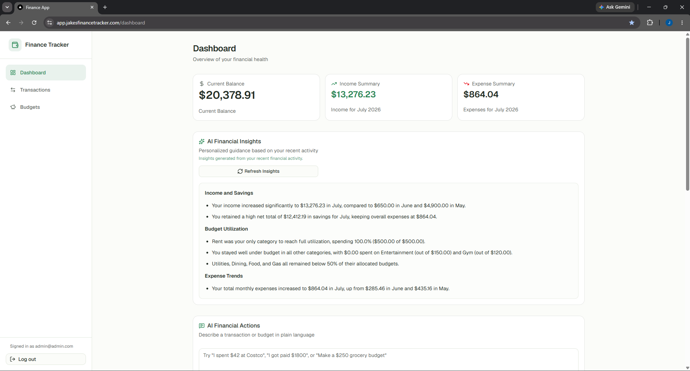
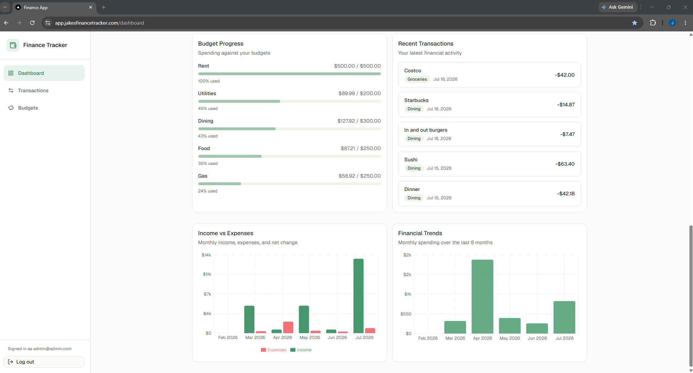
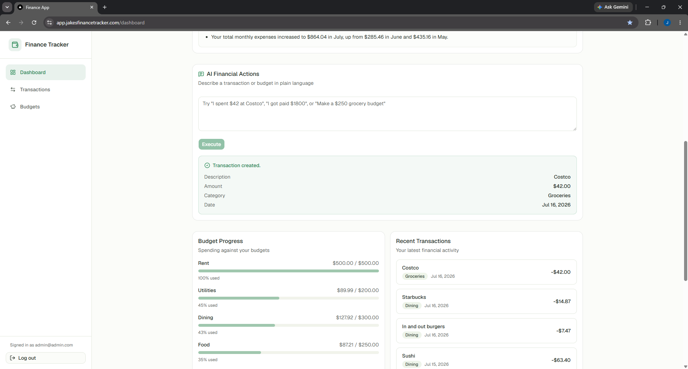
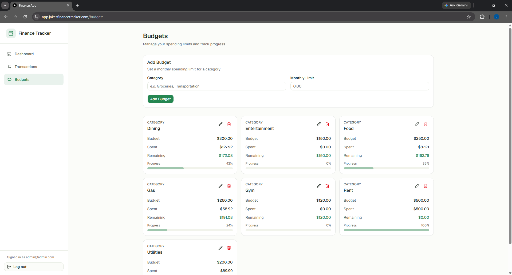
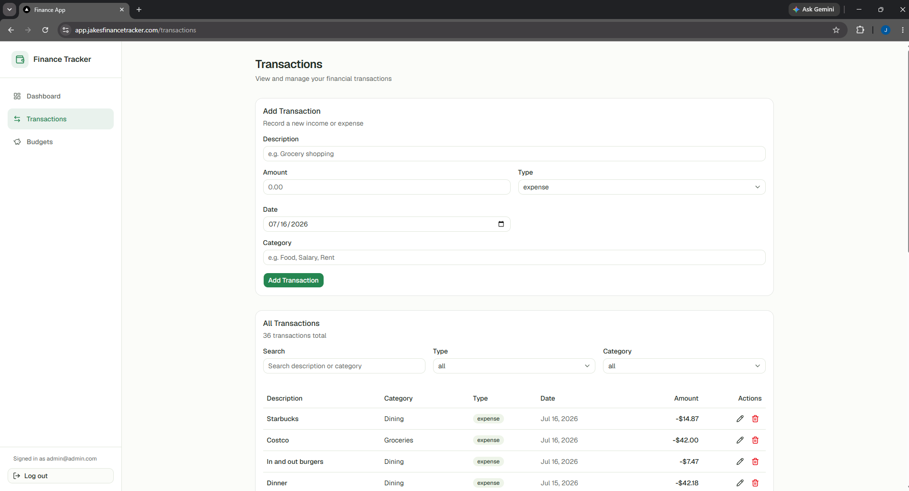
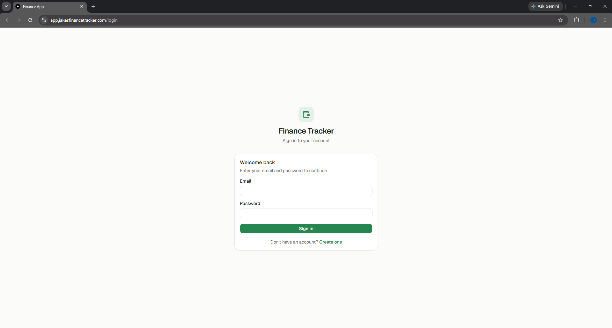
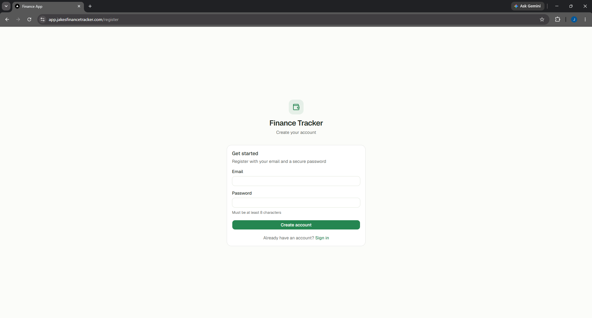
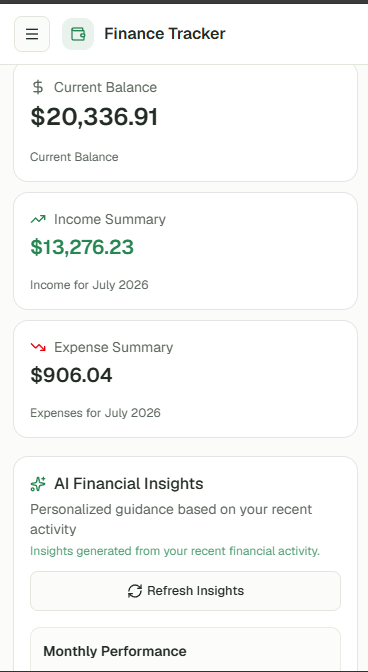

# Finance Tracker


A full-stack personal finance application that helps users track spending, manage monthly budgets, and understand their finances at a glance. Users register, log in, and work with their own isolated data — transactions, budgets, charts, and AI-powered insights — through a clean, responsive web interface deployed to production on AWS.

> For milestone history and technical details, see [PROJECT_STATUS.md](./PROJECT_STATUS.md) and [ARCHITECTURE_GUIDE.md](./ARCHITECTURE_GUIDE.md).

<!-- Benchmarking Docker BuildKit cache -->

---

## Live Demo

| | URL |
|---|---|
| **Production App** | https://app.jakesfinancetracker.com |
| **API** | https://api.jakesfinancetracker.com |
| **API Health** | https://api.jakesfinancetracker.com/health |
| **API Docs** | https://api.jakesfinancetracker.com/docs |

---

# Screenshots

## Dashboard

<p align="center">
  
</p>

<p align="center">
  
  
</p>

The dashboard provides an overview of spending trends, budget progress, AI-generated financial insights, and natural language actions for managing finances.

---

## Budget Management

<p align="center">
  
</p>

Create and manage monthly budgets with real-time progress tracking based on current-month spending.

---

## Transaction Management

<p align="center">
  
</p>

View, search, filter, and manage transactions with categorized expense tracking.

---

## Authentication

<p align="center">
  
  
</p>

Secure authentication using httpOnly cookies with protected routes and persistent sessions.

---

## Mobile Responsive Design

<p align="center">
  
</p>

The application is fully responsive and optimized for desktop, tablet, and mobile devices.

---

## Features

- Secure authentication using httpOnly cookies
- Dashboard analytics — balance, monthly income/expenses, spending trends, recent activity
- Budget management with monthly progress bars
- Transaction tracking — create, edit, delete, search, filter, and paginate
- Spending insights powered by an LLM (Google Gemini)
- Natural language expense and budget entry (e.g. "I spent $42 at Costco")
- Monthly budget progress — current calendar month expenses only
- Charts and visualizations (Recharts)
- Responsive design for phones, tablets, and desktops
- Production deployment on AWS with automated CI/CD

---

## Tech Stack

**Frontend**
- Next.js 15 (App Router)
- TypeScript
- Tailwind CSS v4
- shadcn/ui, React Hook Form, Zod, Recharts

**Backend**
- FastAPI
- SQLAlchemy 2.x
- Pydantic
- PostgreSQL 16

**Infrastructure**
- Docker & Docker Compose
- AWS ECS Fargate
- Application Load Balancer
- Amazon RDS
- Amazon ECR
- ACM (HTTPS)
- Route 53 (DNS)
- GitHub Actions (CI + CD)

**AI**
- Google Gemini Flash
- Structured prompt engineering for insights and natural language actions
- Backend-only API key — never exposed to the browser

---

## Architecture Overview

```
Browser
   ↓
Next.js frontend (ECS Fargate)
   ↓  HTTPS + httpOnly cookie
FastAPI backend (ECS Fargate)
   ↓
PostgreSQL (Amazon RDS)
   ↓
Gemini API (insights & natural language parsing — backend only)
```

The frontend never talks to the database or Gemini directly. The backend enforces authentication, user isolation, validation, and all AI integration.

---

## Interesting Technical Challenges

- **Cookie authentication across subdomains** — JWT stored in httpOnly Secure cookies with `COOKIE_DOMAIN` configured so `app.*` and `api.*` share sessions without client-side token handling
- **CI/CD deployment pipeline** — push to `main` runs pytest, frontend build, Docker validation, then deploys to ECS via GitHub Actions
- **Production AWS infrastructure** — separate ALBs for frontend and backend, RDS PostgreSQL, ECR image registry, ACM TLS termination
- **Natural language parsing** — Gemini returns structured JSON; Pydantic validation and existing CRUD services create records (AI never writes directly to the database)
- **AI-generated spending insights** — sanitized financial aggregates sent to Gemini; Markdown responses rendered on the dashboard

---

## Running Locally

**Prerequisites:** Docker & Docker Compose (recommended), or Node.js 20+ / Python 3.12+ for partial setups.

```bash
cp .env.example .env
docker compose up -d --build
```

| Service | URL |
|---------|-----|
| Frontend | http://localhost:3000 |
| Backend API | http://localhost:8000 |
| API docs | http://localhost:8000/docs |

**Backend tests** (requires PostgreSQL):

```bash
cd backend
python -m venv .venv
source .venv/bin/activate          # macOS/Linux
# .venv\Scripts\Activate.ps1       # Windows
pip install -r requirements-dev.txt
pytest
```

68 automated integration tests cover auth, transactions, budgets, dashboard, and AI endpoints.

See [`.env.example`](.env.example) for environment variables including AI configuration (`AI_ENABLED`, `GEMINI_API_KEY`).

---

## Future Improvements

- Alembic migrations for versioned, reversible schema changes
- GitHub OIDC for AWS deployments (replace long-lived access keys)
- Token refresh and Next.js middleware for server-side route protection
- AI chat assistant with conversation history
- CloudWatch monitoring and alerting
